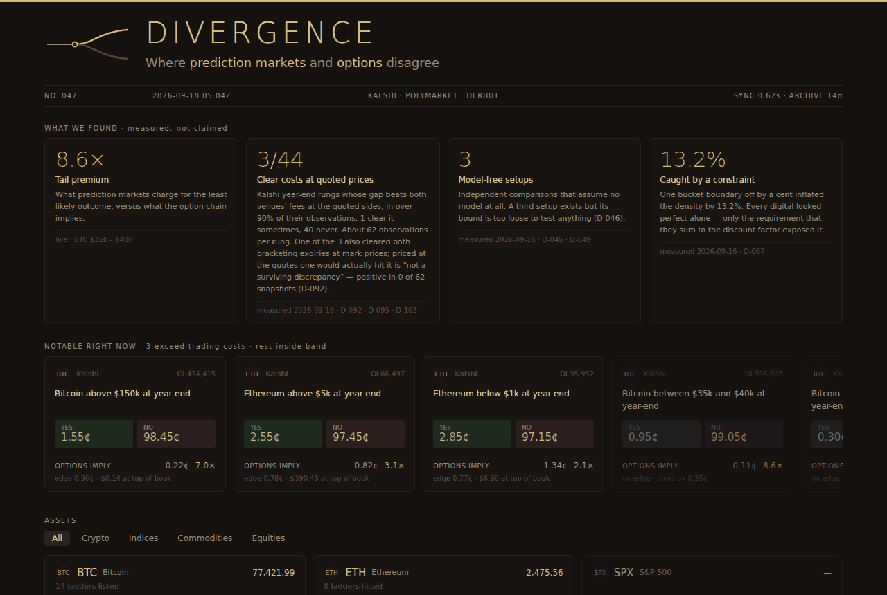

# Divergence

[](https://github.com/DenizErginGunduz/divergence/actions/workflows/tests.yml) [](https://github.com/DenizErginGunduz/divergence/actions/workflows/ref_check.yml) · **Live screen:** [denizergingunduz.github.io/divergence](https://denizergingunduz.github.io/divergence/)

Two markets price the same future event. This measures how far apart they are, and
how much of that distance survives contact with reality.

Prediction markets (Kalshi, Polymarket) quote a probability directly. Listed options
(Deribit) imply a discounted state price through the difference between neighbouring
strikes. Same question, two answers, no model required to compare them.

The short version of what that comparison found: differences at quoted prices are
real and persistent, and none of them survives the full set of controls — both
venues' fees, executable prices on both expiries that bracket the settlement, and
the local strike grid (D-103).

**Start here: [Research Note 1](drafts/RESEARCH_NOTE_1.md).** It is the whole
argument in one read: what was measured, what survived each control, what did
not, and the mistakes found along the way. It is written to D-097 and its numbers
are the findings file's; where any page and the findings disagree, the findings
file and the decision log win.

Not a betting app, not a trading bot, not a signal service.



*`web/index.html` as rendered on 2026-09-18 from snapshot 2026-09-18T0504Z (47 snapshots in the 14-day window at that moment, sync window 0.62 s). Three of the four cards carry findings measured on 2026-09-16 and cite their decision records; the tail-premium card is computed live from the snapshot. The rungs row shows the quoted sides and what the option chain implies at that instant. The live page reads the newest snapshot from this repository and changes three times a day; the picture does not.*

### Reading order

The repository is larger than it needs to be for a first read, so:

| if you have | read |
|---|---|
| five minutes | this page, then the results table below |
| half an hour | [Research Note 1](drafts/RESEARCH_NOTE_1.md) — the whole argument, end to end |
| an hour | add [`docs/METHODOLOGY.md`](docs/METHODOLOGY.md) for the derivations and [`docs/PRIOR_WORK.md`](docs/PRIOR_WORK.md) for what else exists in this area and who did it first |
| you are checking a specific number | [`findings/latest.json`](findings/latest.json), then the script named in the block that produced it |
| you are taking the project over | [`docs/ARCHIVE_SCHEMA.md`](docs/ARCHIVE_SCHEMA.md) and [`scripts/README.md`](scripts/README.md) |

`docs/DECISIONS.md` is the full log — every decision, every retraction, 175 KB of it.
It is a reference, not a read. Nothing on this page depends on opening it.

---

## The catch that makes this non-trivial

**Touch is not terminal.** "Will Bitcoin hit $150k this year" asks whether the price
touches that level at any point. "Will Bitcoin be above $150k on December 31" asks
where it closes. Touch probability is always greater than or equal to terminal at the
same level. Options give terminal directly and touch not at all. Confusing the two
breaks every number downstream, and the two questions sit side by side on the same
exchange with almost identical wording.

**Settlement rarely lines up.** Polymarket daily ladders settle on a Binance candle at
16:00 UTC. Deribit options expire 08:00 UTC on Deribit's own index. Kalshi settles on
CF Benchmarks. Every comparison carries a time gap and a source mismatch, and the
honest move is to measure the gap rather than assume it away.

**A difference is not an opportunity.** Fees, spread, collateral cost, the variance
risk premium and measurement error all live inside the gap. Most of what looks like
mispricing is one of those. This project has now charged both venues' published
fees, priced the trade at quotes that actually stand, and counted the contracts
resting behind them — and what is left does not survive the chain that expires
after the contract settles (D-103).

---

## What has actually been measured

Three venues, collected three times daily since 2026-08-30. The public `raw/` window
is a rolling 14 days; the results below were computed over 117 snapshots and 25 days
from the private mirror, last snapshot 2026-09-24T1834Z. Those are two different
things on purpose, and D-089 says why.

Every number in this section is produced by a script in this repository, and
`scripts/check_readme.py` fails the build when the sentences below stop matching
`findings/latest.json`.

| setup | result | strength |
|---|---|---|
| Kalshi year-end buckets | 3 of 44 rungs show an edge at quoted prices after both venues' fees, in over 90% of their observations — the weakest in 107 of 111. A quoted-executable discrepancy, not a size-executable one (D-095); no dollar figure is quoted as a trade. | model-free |
| The same, against BOTH bracketing expiries (mark prices) | only **1 of the 3** clears the option value at either end. The other two cannot be separated from a seven-day expiry gap. | model-free |
| The survivor, against executable prices and the local strike grid | **not a surviving discrepancy**: the pre-committed kill test (D-092) finds the margin positive in 0 of 62 snapshots (D-103). 0 of 44 rungs in the declared family survive the full test (D-096). | model-free |
| Polymarket dailies | 10.1% of quotable rungs show an edge under the same test. Was **24.2%** until the same repairs reached this script; more than half of it was method (D-085). | model-free, noisy |
| Long-horizon touch bound | 0.2% arithmetic violations; 92.7% above the 2x bound | model-dependent, weak |

The three Kalshi rungs are all tails: BTC above $150k, ETH above $5k, ETH **below**
$1k. Nothing in the body of any distribution shows an edge. On mark prices, after the
expiry band is admitted, only ETH above $5k was left, by about 0.4 cents. Priced at
the quotes one would actually hit on the chain that expires after the contract
settles, with Deribit's fee on those quotes and Kalshi's on the bid, that margin is
negative in every snapshot (D-103).

**Read that as a negative result, because it is one.** The project went looking for
cross-market divergences, found three that persist at quoted prices across every
snapshot for two and a half weeks, and then established that two cannot be
separated from the seven-day expiry gap and the third does not survive executable
prices on the later chain. What remains is a fact about market structure — price
differences that persist at the top of the book and that the executable side of the
same book removes — not a trade. December's Deribit weeklies straddling 1 January
will let the same test run with a band of days; nothing is built to hurry that.

The touch result is worth reading carefully. A violation rate under half a percent
is a pipeline validation, not a finding — if the digital calculation were wrong,
impossible values would show up here in the hundreds. The share above the 2x bound
does not show mispricing; it
shows that the driftless reflection bound is the wrong tool for long-dated deep OTM
strikes. An earlier version of that script compared against a lognormal terminal and
reported 8.7% "arithmetic violations", which were the model's error, not the market's.

---

## Running it

Python 3.12. **No dependencies** — standard library only, nothing to install.

```bash
git clone https://github.com/DenizErginGunduz/divergence.git
cd divergence
python scripts/archive.py         # reads the archive, prints what it found
python scripts/write_findings.py  # runs every measurement, writes findings/latest.json
```

`scripts/README.md` lists what each script asks and how to run it.

Nothing needs network access to reproduce a measurement: the archive is in the
repository. Only the collector talks to the outside world.

---

## Repository map

```
collector/collect.py   the only thing that fetches from the internet; runs 3x daily in CI
raw/                   immutable snapshots, rolling 14-day window  (docs/ARCHIVE_SCHEMA.md)
state/latest.json      pointer to the newest snapshot of each stream
scripts/               measurements; scripts/legacy/ does not run, by design
findings/latest.json   measurement output, written by CI
web/index.html         the terminal, reads the archive live
docs/                  methodology, data sources, product and design decisions
docs/STRATEGY.md       what the project is now (three layers), read with RESEARCH_ROADMAP,
                       PRODUCT_ROADMAP, DECISION_GATES, PRIOR_WORK, IDEA_BACKLOG (D-091)
```

---

## How this project works

1. **Nothing is invented.** An endpoint, a price, a rule or a platform's coverage is
   either measured or written down as unknown.
2. **Raw data is kept unchanged.** The methodology will change; the ability to
   recompute from the original bytes must not.
3. **Settlement rules are quoted in full, never summarised.** The wording decides
   whether two contracts are comparable.
4. **Uncertainty is surfaced, not resolved.** A row we cannot measure stays visible
   and says why.
5. **Every number on screen traces to a script.** The interface holds no numbers of
   its own; it reads `findings/latest.json`. Two checks keep the written pages from
   drifting away from it: `ref_check.py` fails the build on a decision number that was
   never recorded, and `check_readme.py` fails it when the results table above stops
   matching the findings file. Prose elsewhere in `docs/` is not checked — that gap is
   what Denetim 3 was for (D-090).
6. **Retractions are recorded like results.** Decisions that turned out wrong stay in
   the log with the reason.

---

## Terminology

Avoided: fair value, true probability, AI probability, edge, signal, arbitrage,
insider, smart money.

Used: prediction-market-implied probability, options-implied risk-neutral probability,
cross-market probability gap, terminal and touch probability, measurable and not
measurable, settlement comparability.

We do not name something we cannot claim. "Edge" and "signal" promise something
actionable; as far as this has been measured, there isn't one.

---

## Licence

Three different things live here and they are not under one licence.

| what | licence |
|---|---|
| Code — `collector/`, `scripts/`, `web/` | [MIT](LICENSE) |
| Writing — `docs/`, this README | [CC BY 4.0](https://creativecommons.org/licenses/by/4.0/) |
| Market data — `raw/` | **not ours, and not licensed by us** |

The data belongs to Kalshi, Polymarket and Deribit and is subject to their terms.
We hold no rights in it and grant none. `raw/README.md` has the links and
`docs/DATA_SOURCES.md` records what those terms say and the position we took.

Take the code and do what you like with it. Quote the methodology with attribution.
For the data, go to the venues.

---

## Status, scope and limitations

**Running:** the collector (three times daily in CI), the archive, the sixteen
scripted steps `measure.yml` runs in order (archive smoke test to written findings), two documentation checkers, and the
terminal UI. Tests: 114, no dependencies.

**In progress:** Research Note 1 is frozen at v1 (D-107) and waits on its publication
gate; the exposure-design branch is specified and not yet computed; the product stages
are defined behind evidence gates and not built (`docs/DECISION_GATES.md`).

**Scope, stated so that nothing here is read as more than it is:**

- `raw/` is a rolling 14-day window. It bounds the working tree, not git history:
  `.git` still grows about 4 MB a day and a full clone reaches every snapshot ever
  committed. The full archive lives in a private mirror (docs/DATA_SOURCES.md).
- The forecast-quality question is not answered and is not answerable yet: the
  resolved-event sample is nine informative independent events — the count over the
  full private mirror, under the definition of D-081, which separates events whose
  quote carried information from fifteen-minute contracts quoted minutes before they
  settle — and no scoring has been run on it (`docs/VALIDATION_SPEC.md`).
- In the run of 2026-09-16T0504Z, 149 of 460 flow markets hit the fetch limit with no
  gap flagged. Probably fine, not verified.
- Assets beyond BTC and ETH are collected but not measured (D-100).
- ETH above $5,000, the one year-end rung that cleared the mark-price maturity stress
  test, is **not a surviving discrepancy** under the pre-committed kill test of D-092
  (D-103). It is not called a finding, an artefact or noise; those are the verdict's
  words and they are used as written.
